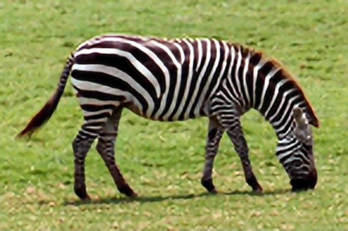

# SRCNN-SSIM
We have put together an implementation of SRCNN with SSIM cost in pytorch. 

### How it Works

An image is changed from RGB to YCbCr colour scheme. The image is scaled by Bicubic Interpolation. It is then passed through a SRCNN, trained for 400 epochs with SSIM (Structural Similarity) as the cost function, which produces a sharper image. The sharper image is change from YCbCr to RGB color scheme.

Please read the comments for a deep understanding of the functioning.

### Results

---> Original Image

---> Bicubic Interpolation Output (4x Upscaled and Downscaled)

---> SRCNN Output (4x Upscaled)

---> SRCNN Output (4x Upscaled and Downscaled)

